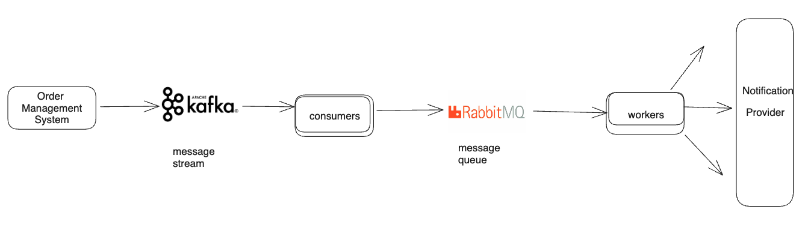

This is just for learning and experiment

## Problem Statement
Suppose you are building a notification platform for e-commerce company. From order management system, you will receive events for notifications to various segments of customers (premium, vip, normal)

## Architecture

## Steps to run

1. docker-compose up -d
2. run 2 consumers : python3 notification_consumer.py
3. run 3 workers
    1. python3 notification_worker.py VIP
    2. python3 notification_worker.py PREMIUM
    3. python3 notification_worker.py NORMAL
4. python3 oms_publisher.py